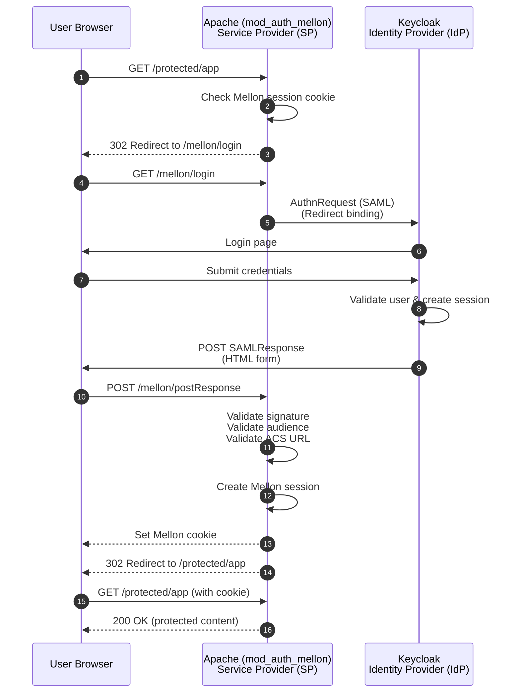

# Authentication Flow

# High-Level Configuration steps
```mermaid
flowchart TD
    A[Start] --> B[Install Apache HTTP Server]
    B --> C[Install Apache Mellon Module]
    C --> D[Generate SP metadata and private keys]
    D --> E[Configure Mellon module in Apache]
    E --> F[Install & configure Keycloak]
    F --> G[Create Realm, Client (SAML), Users]
    G --> H[Upload SP metadata to Keycloak]
    H --> I[Configure Apache virtual host with Mellon directives]
    I --> J[Test SAML authentication flow]
    J --> K[Done: Users can login via Keycloak using SAML]
```
